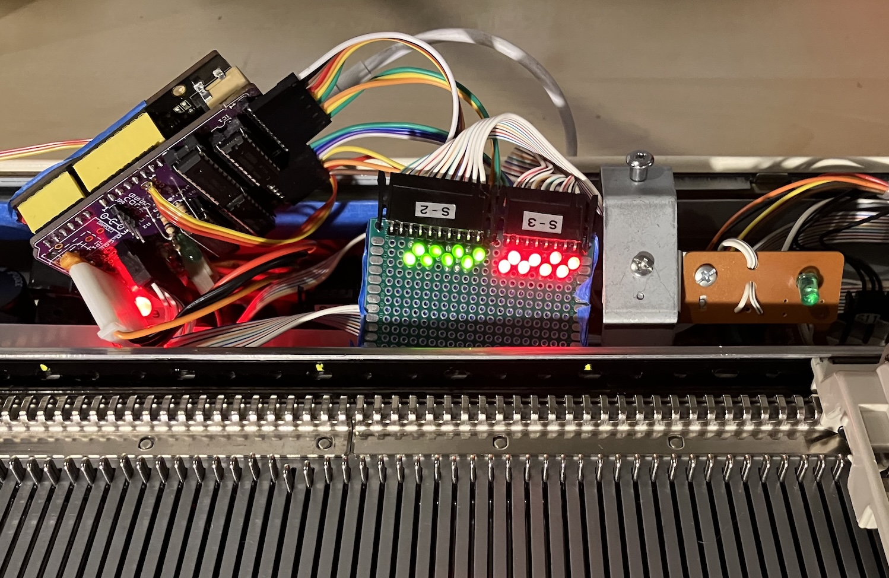
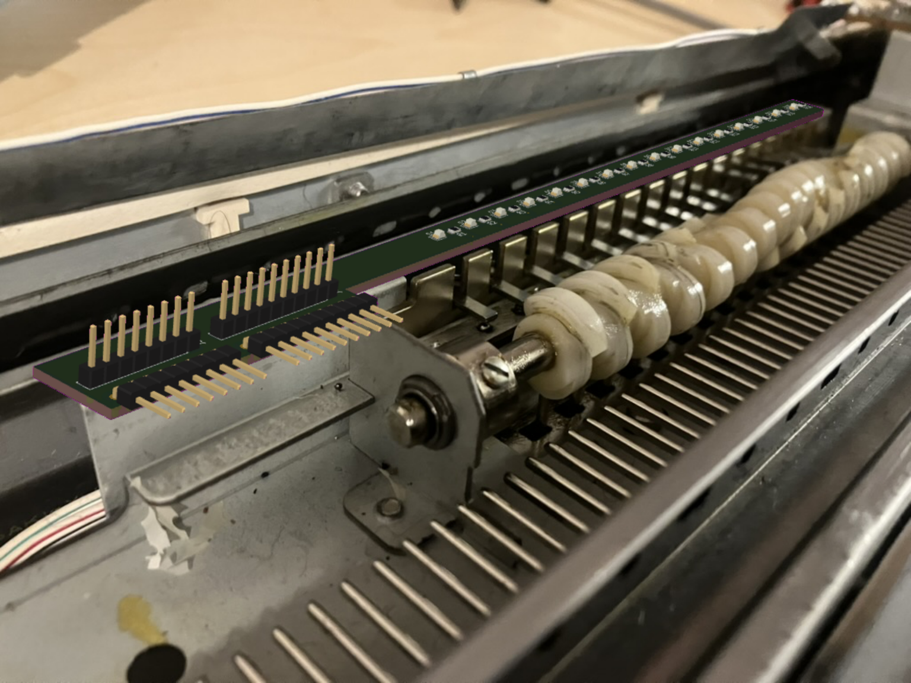
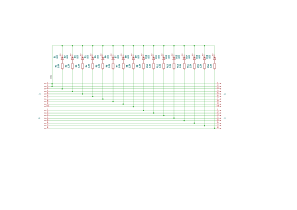

# Solenoid LED strip for Brother electronic knitting machines

This board is meant to be used as a debugging aid when working on alternative electronics for the Brother KH-9xx series, such as [AYAB](https://github.com/AllYarnsAreBeautiful). But as it simply inserts itself between the electronics and the solenoids, it can also be used with the machine's original electronics, to understand how they drive the solenoids.

I have not built the board described by this KiCad project yet, only a prototype from the schematic. No guarantee of any kind is offered as to the suitability of these files for producing a working device.

## Prototype board

This board I built uses the same schematic:

## Mockup

## Schematic

## Tracks

## [Interactive view](https://kicanvas.org/?github=https%3A%2F%2Fgithub.com%2Fjonathanperret%2Fayab-hardware%2Ftree%2Fsolenoid-led-strip%2Fsolenoid-led-strip) courtesy of [KiCanvas](https://kicanvas.org)